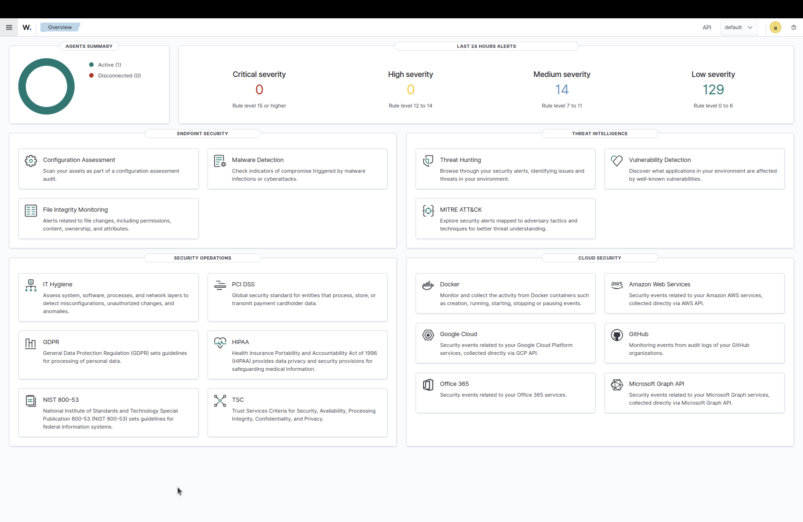
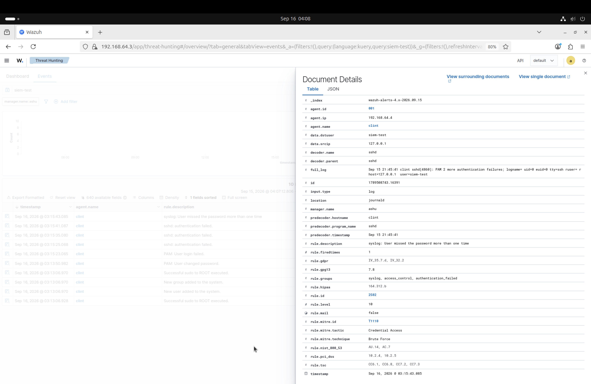
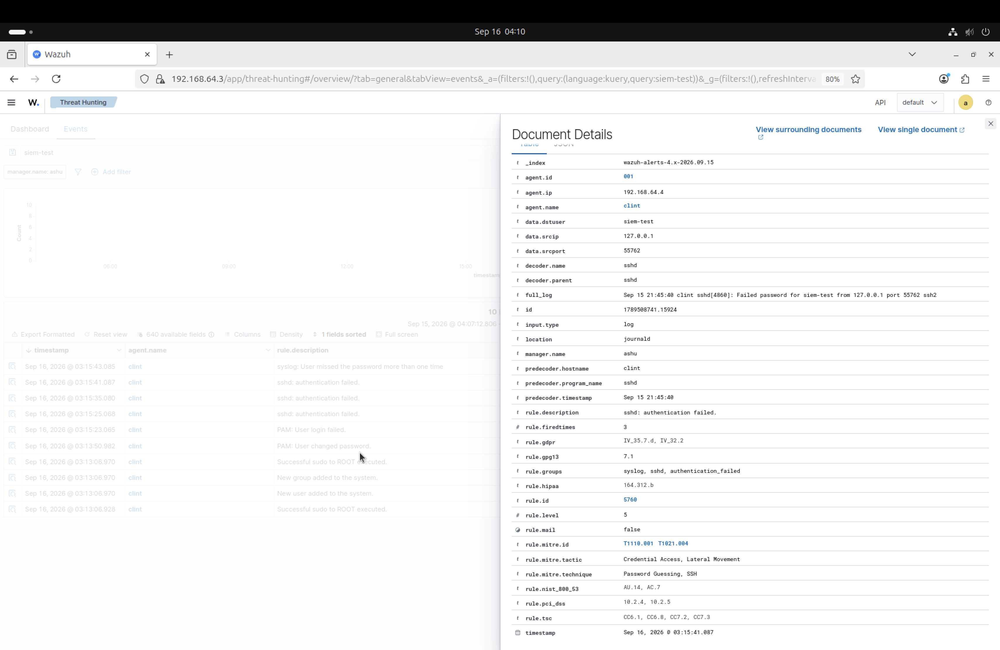
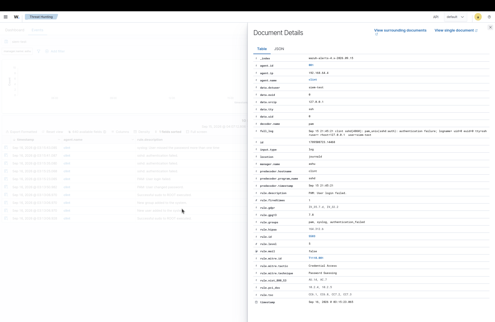
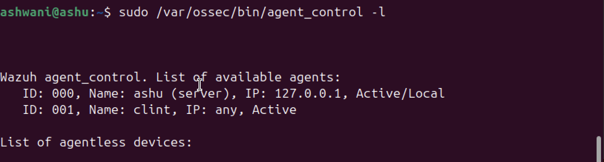

# Wazuh SIEM Security Monitoring Lab

## About the Project

This project is a small SIEM lab built with Wazuh and two Ubuntu virtual machines.

The main purpose of the lab was to learn how a SIEM collects security logs, generates alerts for suspicious activity, and helps in investigating an incident.

For the practical test, I generated multiple failed SSH login attempts against a test account and investigated the alerts generated by Wazuh.

## Lab Setup

| Machine   | Hostname | Role                      | IP           |
| --------- | -------- | ------------------------- | ------------ |
| Server VM | ashu     | Wazuh Manager + Dashboard | 192.168.64.3 |
| Client VM | clint    | Wazuh Agent               | 192.168.64.4 |

Wazuh Manager and Wazuh Dashboard were installed on the Server VM.

The Client VM was configured with the Wazuh Agent and connected to the Manager.

## What I Tested

I created a temporary Linux account named `siem-test` on the Client VM and used SSH to generate failed authentication attempts.

```bash
ssh siem-test@127.0.0.1
```

I entered an incorrect password multiple times.

The SSH connection returned:

```text
Permission denied, please try again.
```

This generated authentication-related alerts in Wazuh.

## Alerts Generated

### Rule 2502

**Level:** 10

This alert was generated after repeated password failures and was mapped by Wazuh to:

`T1110 - Brute Force`

### Rule 5760

**Level:** 5

This alert identified the failed SSH authentication attempts.

MITRE ATT&CK mappings shown by Wazuh included:

* `T1110.001 - Password Guessing`
* `T1021.004 - SSH`

### Rule 5503

**Level:** 5

This alert was related to the PAM authentication failure.

MITRE ATT&CK:

`T1110.001 - Password Guessing`

## Investigation

The alerts were investigated through the Wazuh Dashboard and the Wazuh alert logs.

The main findings were:

* Endpoint: `clint`
* Wazuh Agent ID: `001`
* Agent IP: `192.168.64.4`
* Target account: `siem-test`
* Source IP: `127.0.0.1`
* Service: SSH
* Activity: Multiple failed authentication attempts

The source IP was `127.0.0.1` because the SSH test was performed locally on the Client VM.

I also checked for evidence of a successful login and did not find a successful authentication event for the test account.

## Response

As a containment test, I locked the test account:

```bash
sudo passwd -l siem-test
```

After locking the account, another SSH login attempt was rejected with:

```text
Permission denied (publickey,password).
```

This confirmed that the account could no longer be used for the SSH login test.

After completing the investigation, the temporary test account was removed from the Client VM.

## MITRE ATT&CK

| Technique            | ID        | Activity                       |
| -------------------- | --------- | ------------------------------ |
| Brute Force          | T1110     | Repeated failed authentication |
| Password Guessing    | T1110.001 | Incorrect password attempts    |
| Remote Services: SSH | T1021.004 | SSH authentication             |

## Evidence

### Wazuh Dashboard



### Rule 2502 - Brute Force



### Rule 5760 - SSH Authentication Failure



### Rule 5503 - PAM Login Failure



### Wazuh Agent Connectivity



### Wazuh Manager Status


### Wazuh Dashboard Status


### Wazuh Agent Status


## What I Learned

* Basic Wazuh Manager and Agent setup
* Linux authentication log monitoring
* SSH authentication monitoring
* SIEM alert investigation
* Understanding Wazuh rules and alert levels
* Using MITRE ATT&CK mappings during investigation
* Basic incident containment
* Checking for successful authentication after a suspected attack
* Verifying the status and connectivity of Wazuh components

## Project Structure

```text
wazuh-siem-security-monitoring-lab/
├── README.md
├── evidence/
│   ├── 01-wazuh-overview.png
│   ├── 02-rule-2502-brute-force.png
│   ├── 03-rule-5760-ssh-failure.png
│   ├── 04-rule-5503-pam-failure.png
│   ├── 05-agent-connectivity.png
│   ├── 06-wazuh-manager-status.png
│   ├── 07-wazuh-dashboard-status.png
│   └── 08-wazuh-agent-status.png
└── incident-report/
    └── incident-report.md
```

## Disclaimer

This lab was created for learning and portfolio purposes in an authorized virtual environment.
